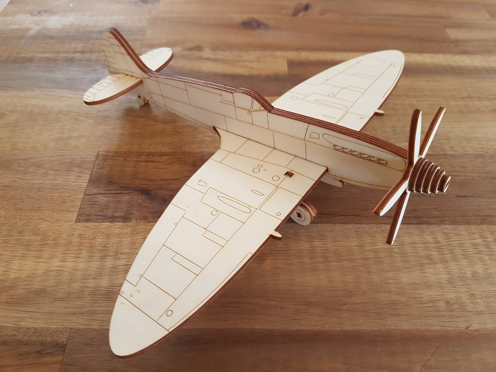
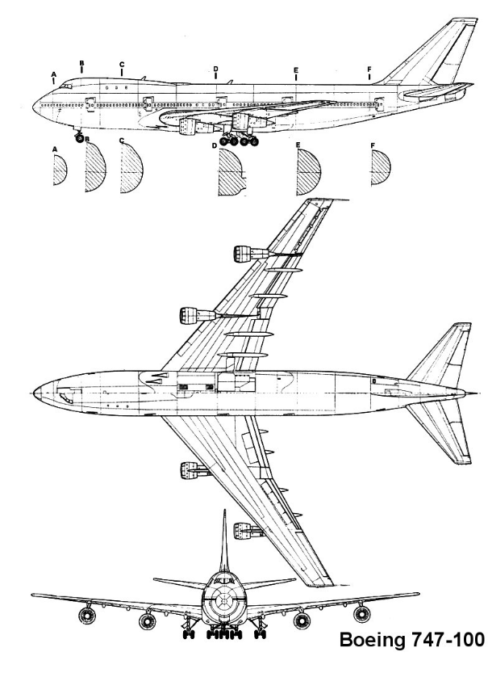
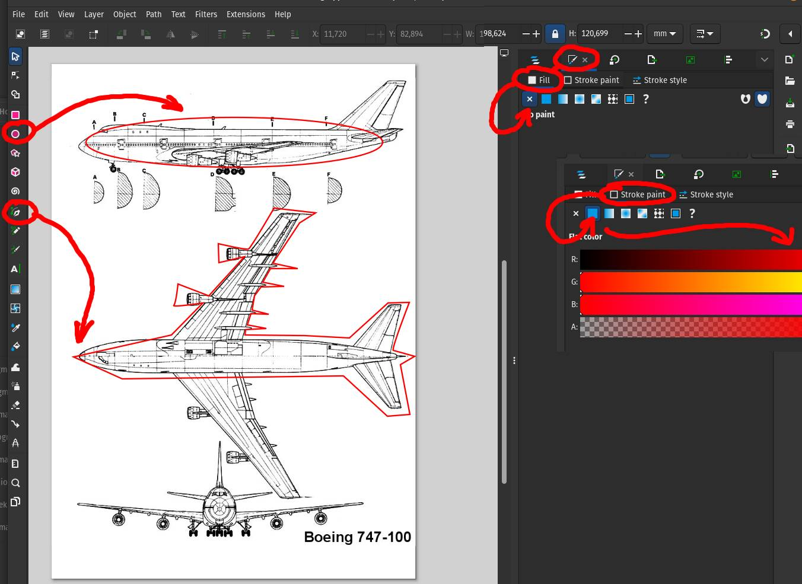
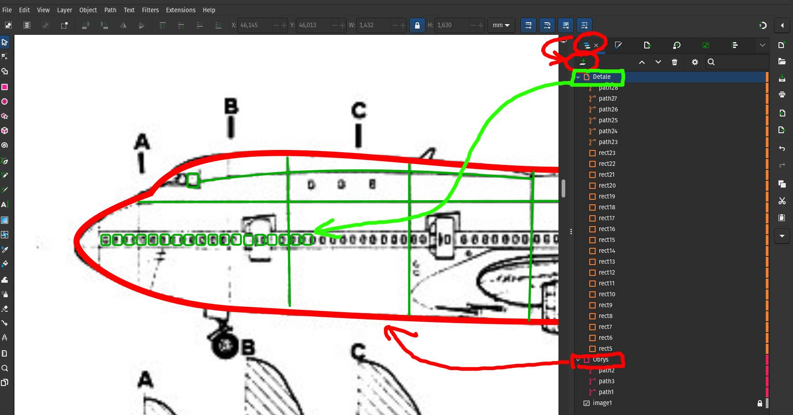
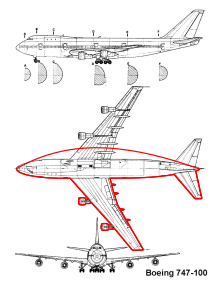
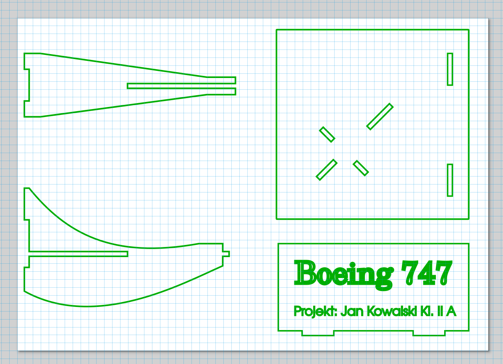

# INF239-AirplaneLasercut

### Zadanie polega na przygotowaniu modelu samolotu wykonanego metodą wycinania laserowego.

---

#### I.Prace przygotowawcze
1. Wybierz ulubiony samolot (dla którego dostępny jest blueprint). Sprawdź czy twój wybór nie jest już zajęty na stronie http://animateria.pl/tl-planes/
2. Znajdź w internecie i pobierz blueprint w jak najlepszej jakości (rozdzielczości obrazu). Blueprint to rysunek techniczny (rzuty izometryczne) z których najważniejsze to widok z góry i widok z boku (poniżej przykład dla B747).

   
4. Wyślij blueprint do swojego folderu na dysku Google lub zapisz na pendrive blueprint (plik graficzny)

#### II. Artykuł na portalu Animateria.pl
1. Aby usystematyzować informacje na temat wybranych przez was portów, przygotuj artykuł z ogólnodostępnymi informacjami na temat twojego samolotu i opublikuj na stronie http://animateria.pl/tl-planes/ (poniżej instrukcja jak to zrobić).
2. Zarejestruj się na stronie http://animateria.pl/register wypełniając formularz i wysyłając dane klikając "Zarejestruj się". Rejestracja jest bezpieczna a dostęp do waszych danych podanych w formularzu mam tylko ja jako nauczyciel. Jeśli nie chcecie wyświetlać swojego imienia i nazwiska jko podpis pod artykułem, to proszę podać dowolny Nick (pseudonim) w polu "podpis pod artykułem". Email jest wymagany w celu ochrony przed spamem.
3. Po rejestracji i/lub zalogowaniu utwórz wpis:

zdefiniuj tytuł (najlepiej aby w tytule była tylko Nazwa samolotu) i zredaguj treść dotyczącą wybranej maszyny. Umieść w artykule co najmniej jedno zdjęcie i informacje o maszynie. Tworzenie wpisu przebiega podobnie jak w edytorze tekstu poprzez wpisywanie tekstów i wstawianie obrazów i/lub tabelek jako bloków. W tworzeniu wpisu można się wspomóc tutorialem (np: https://www.youtube.com/watch?v=AUd718XYvF4) ale powinniście poradzić sobie bez przygotowania. Jeśli napotkasz problemy podczas rejestracji lub tworzenia wpisu, stwórz dokument tekstowy (Word/OpenDocument) zawierający artykuł i wyślij go na dysk Google lub przynieś na pendrive.

4. Dodaj zdjęcie/znalezione (znaleione w internecie) i podpisz podając źródło.
5. Ustaw obrazek wyróżniający.

#### III. Obrys samolotu przygotowany jako plik wektorowy w dowolnym programie graficznym.
1. Pobierz i zainstaluj dowolny program graficzny pozwalający na eksport obrazu jako grafikę wektorową. Zalecany Inkscape dostępny między innymi w sklepie Windows lub pod tym linkiem: https://inkscape.org/

2. Po instalacji i uruchomieniu programu utwórz pusty dokument lub otwórz blueprint w programie. Do pustego dokumentu przeciągnij blueprint i dopasuj go arkusza dokumentu. Postaraj się skalować proporcjonalnie (bez zmiany stosunku boków obrazu).

3. Użyj podstawowych narzędzi rysunkowych aby utworzyć pojedynczy obrys dla widoku z góry i widoku z boku. Zastosuj dowolny obrys bez wypełnienia (lub z wypełnieniem półprzezroczystym). Atrybuty wypełnienia i obrysu można zmienić w panelu "Wypełnienie i obrys". Poniżej dwa proponowane podejścia:

   - Zacznij od elipsy którą umieszczasz na blueprincie na widoku z boku i/lub z góry. Przekonwertuj obiekt elipsy do Ścieżki: "Path > Convert to Path". Po konwersji do zwykłej ścieżki dodawaj i przesuwaj kolejne węzły umieszczane na obrazie w charakterystycznych punktach na blueprincie.

   - Zacznij od narzędzia pióro (Pen tool) i klikaj na obrazie tworząc linię łamaną wokół obrysu na blueprincie. Dodawaj węzły i przesuwaj je w razie potrzeby do miejsc charakterystycznych na blueprincie.
  
W obu scenariuszach pamiętaj że dodawanie punktów odbywa się przez dwuktotne kliknięcie na segmencie ścieżki. W ten sam sposób można usunąć nadmiarowe węzły. Aby zamienić segmenty proste na krzywe chwytając przesuwając segmenty między węzłami. Uwzględnij wystające elementy (np silniki) ale pomiń drobne szczegóły, które trudno będzie wyciąć (np anteny)

4. Postaraj się dopasować obrys do blueprintu dla widoków z góry i z boku

5. Zapisz dokument jako svg (lub inny format wektorowy)

#### IV. Model fizyczny
1. Przed wycięciem laserowym wypróbuj model kartonowy. Jeśli masz możliwość to wydrukuj na drukarce (laserowej lub atramentowej) swój projekt. Wytnij dwa obrysy (widok z góry i widok z boku) a następnie dopasuj je dosiebie i zaplanuj nacięcia (natnij norzyczkami) aby mozna było połączyć ze sobą dwa obrysy. W razie konieczności przed wycięciem naklej wydruk na tekturkę i wytnij z tektury.
2. Nacięcia powinny być jak najkrótsze i mogą być skierowane zarówno w poziomie jak i w pionie. Poniżej przykład. 
3. W razie potrzeby powtórz wydruk i wycinanie aby uzyskać stabilnną konstrukcję.
4. Wróć do programu i na osobnej warstwie zaznacz wcześniej zaplanowane linie cięcia (dodaj szerokość wcięć 3mm).
5. Dodaj w ramach dokumentu tabliczkę znamionową zawierającą twoje imię i nazwisko, Nazwę samolotu i skalę modelu (oblicz skalę mierząc samolot na wydruku A4 i porównując z oryginałem).
6. Model ze sklejki zostanie przygotowany na podstawie waszych projektów po przetestowaniu koncepcji wycięcia modelu kartonowego.

#### V. Model zaawansowany
1. Dla widoku z góry można przygotowac tylko połowę profilu a drugą połowę utworzyć przez odbicie lustrzane i połąćzenie węzłów. Jeśli to wyaj ci się zbyt skomplikowane, obrysuj całyość jednorazowo.

2. Utwórz na kolejnej warstwie obraz szczegółów (można użyć dowolnego koloru) po uprzednim zablokowaniu warstwy/warstw z obrazem i obrysami z góry i z boku. W miarę możliwości przedstaw szczegóły takie jak okna, drzwi, krawędzie paneli, oznaczenia lini lotniczych) Zastosuj dowolne kolory, ale cięcie i grawerowanie laserowe będzie jednokolorowe (ciemne linie na jasnej sklejce)
3. Aby zwiększyć realizm można zaplanować silniki jako odrębne elementy i przygotować wcięcia pozwalające na wsunięcie na skrzydła.
4. Można pomyśleć o szczegółąch takich jak podwozie jeśli na wydruku z drukarki będą one większe niż 3 milimetry.
5. Można dodać uniwersalne wcięcie pozwalające na montaż uniwersalnej podstawki. (jak ba rysyunku poniżej).
6. W miejscach wcześniej zaplanowanych nacięć utwórz precyzyjne wcięcia o szerokości równej grubości sklejki (dokładnie 3 mm). Pomiarów można dokonywać w programie graficznym.
7. Zastanów się jak nanieść drugą stronę szczegółów (drugi bok, spód).

